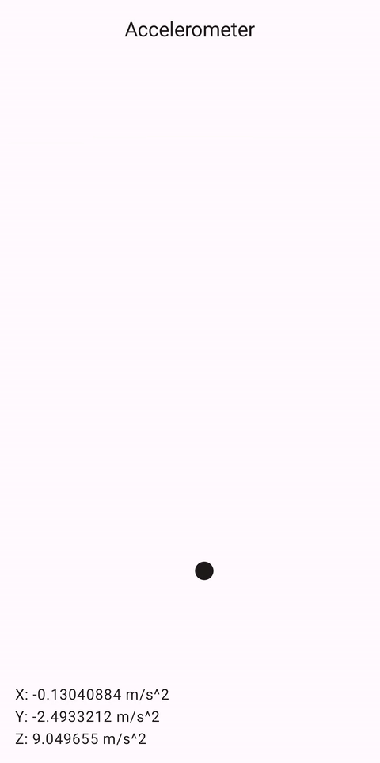

# Compose Sensors

This library is a thin wrapper around the [Android Sensor APIs](https://developer.android.com/guide/topics/sensors/sensors_overview),
designed to make it easier to work with them in [Jetpack Compose](https://developer.android.com/jetpack/compose).

|  |  |  |
|-----------------------------------------|-------------------------|---------------------------------|

## Usage

### Dependency

In module `build.gralde.kts` file:

```kotlin
dependencies {
    implementation("dev.ricknout.composesensors:composesensors:$version")
}
```

The library is available via `mavenCentral()`. Versions can be found on the [releases page](https://github.com/ricknout/compose-sensors/releases).

### Core APIs

The core APIs provide composable access to the Android sensor framework classes:

```kotlin
// Get the SensorManager
val sensorManager = getSensorManager()

// Check if a certain type of sensor is available
val available = isSensorAvailable(type = Sensor.TYPE_ACCELEROMETER)

// Get a sensor
val sensor = getSensor(type = Sensor.TYPE_ACCELEROMETER)

// Remember a sensor value as State that updates as SensorEvents arrive
val sensorValue by rememberSensorValueAsState(type = Sensor.TYPE_ACCELEROMETER) { event ->
    // Transform SensorEvents
}
```

### Per-sensor APIs

The per-sensor APIs build on the core APIs and provide convenience by:
* Not having to pass the sensor `type` parameter
* Handling the transformation of `SensorEvent`s for each type of sensor, by using the `SensorValue` class

```kotlin
// Check if accelerometer sensor is available
val available = isAccelerometerSensorAvailable()

// Get accelerometer sensor
val sensor = getAccelerometerSensor()

// Remember accelerometer sensor value as State that updates as SensorEvents arrive
val sensorValue by rememberAccelerometerSensorValueAsState()
// Accelerometer sensor values. Also available: sensorValue.timestamp, sensorValue.accuracy
val (x, y, z) = sensorValue.value
```

The following sensor types are available:

| Type           | Availability                     | Sensor                   | Sensor value                              |
|----------------|----------------------------------|--------------------------|-------------------------------------------|
| Accelerometer  | `isAccelerometerSensorAvailable` | `getAccelerometerSensor` | `rememberAccelerometerSensorValueAsState` |
| Gyroscope      | `isGyroscopeSensorAvailable`     | `getGyroscopeSensor`     | `rememberGyroscopeSensorValueAsState`     |
| Light          | `isLightSensorAvailable`         | `getLightSensor`         | `rememberLightSensorValueAsState`         |
| Magnetic field | `isMagneticFieldSensorAvailable` | `getMagneticFieldSensor` | `rememberMagneticFieldSensorValueAsState` |
| Pressure       | `isPressureSensorAvailable`      | `getPressureSensor`      | `rememberPressureSensorValueAsState`      |
| Proximity      | `isProximitySensorAvailable`     | `getProximitySensor`     | `rememberProximitySensorValueAsState`     |

Watch this space, more types to come!

## License

```
Copyright 2023 Nick Rout

Licensed to the Apache Software Foundation (ASF) under one or more contributor
license agreements. See the NOTICE file distributed with this work for
additional information regarding copyright ownership. The ASF licenses this
file to you under the Apache License, Version 2.0 (the "License"); you may not
use this file except in compliance with the License. You may obtain a copy of
the License at

   http://www.apache.org/licenses/LICENSE-2.0

Unless required by applicable law or agreed to in writing, software
distributed under the License is distributed on an "AS IS" BASIS, WITHOUT
WARRANTIES OR CONDITIONS OF ANY KIND, either express or implied. See the
License for the specific language governing permissions and limitations under
the License.
```
